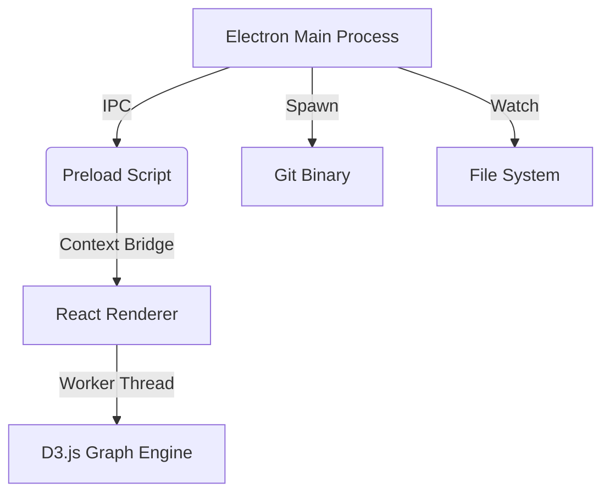

# GitCanopy


> **The Architectural Spine of Your Repository.**

GitCanopy is a high-performance, railway-style Git client designed for professional engineers who value architectural clarity over decorative noise. It transforms complex commit histories into a stable, easy-to-read graph, enabling a hyper-minimalist and lightning-fast workflow.

---

## 🚀 Why GitCanopy?

Traditional Git clients often clutter the view or struggle with large repositories. GitCanopy is built on a different philosophy: **"Developer First"**. We prioritize data density, rendering speed, and semantic clarity.

### 🌟 Core Capabilities

#### 🚆 Visualization Engine
*   **Main Spine Architecture**: Vertical lanes keep your primary branch locked to the left, providing a stable reference point.
*   **Semantic Coloring**: Commits are instantly recognizable by intent (Features, Fixes, Docs) and geometry (Merges, Reverts).
*   **Focus Mode**: Hover over any node to trace recursive lineage, isolating the "story" of a feature.

#### ⚡ Professional Performance
*   **Virtualized Rendering**: Scroll through **10,000+ commits** at 60FPS using industry-leading windowing techniques.
*   **Web Worker Layout**: Heavy graph calculations happen off-thread, ensuring zero UI lag.
*   **Memory Safety**: Safe `spawn` interaction with 10MB safety buffers prevents crashes on massive diffs.

#### ✍️ Seamless Workflow
*   **Uncommitted Changes**: A dedicated view for your working directory with high-fidelity unified diffs.
*   **Stage & Commit**: A tightly integrated, keyboard-friendly interface for crafting atomic commits.
*   **Push & Sync**: One-click synchronization with remote repositories.

#### 📊 Deep Insights
*   **Team Metrics**: Analyze contributor impact and activity trends.
*   **File Hotspots**: Identify high-churn files and potential architectural bottlenecks.
*   **Stash Gallery**: Visual management of your Git stashes.

---

## 🛠 Installation & Setup

### Prerequisites
*   **Node.js**: >= 18.0.0
*   **Git**: Installed and available in PATH
*   **Bun** (Recommended): For fastest build times

### Quick Start

1.  **Clone the project**
    ```bash
    git clone https://github.com/TainYanTun/GitCanopy.git
    cd GitCanopy
    ```

2.  **Install dependencies**
    ```bash
    # Using Bun (Recommended)
    bun install

    # Or using npm
    npm install
    ```

3.  **Run in Development Mode**
    ```bash
    bun run dev
    ```
    This launches both the Electron main process and the React renderer with hot-reload enabled.

### Build for Production

```bash
# Build executable for your current OS
bun run dist
```

---

## 📖 Usage Guide

### 📂 Opening a Repository
*   Click **Open Repository** on the Welcome Screen.
*   Or press `⌘ + O` (Ctrl+O on Windows/Linux).
*   Select any folder containing a `.git` directory.

### 🧭 Navigation
*   **Graph View**: The primary visual DAG for history navigation.
*   **Commit History**: A searchable list of all commits.
*   **Changes View**: Review and stage your local modifications.

### ⌨️ Keyboard Shortcuts

| Action | macOS | Windows/Linux |
| :--- | :--- | :--- |
| **Open Repository** | `⌘ + O` | `Ctrl + O` |
| **Refresh / Sync** | `⌘ + R` | `Ctrl + R` |
| **Commit Changes** | `⌘ + Enter` | `Ctrl + Enter` |
| **Close Panel** | `Esc` | `Esc` |
| **Toggle Fullscreen** | `⌃ + ⌘ + F` | `F11` |

---

## 🏗 Technical Architecture

GitCanopy is built on a modern, type-safe stack designed for security and maintainability.



*   **Environment**: Electron (Isolated Renderer, Safe IPC)
*   **Frontend**: React + TypeScript + Tailwind CSS (Zed-inspired theme)
*   **Graphing**: D3.js calculated in Web Workers
*   **State**: Event-driven architecture with React Hooks

---

## 🤝 Contributing

We welcome contributions! Please see our [Roadmap](PRODUCTION_ROADMAP.md) for current priorities.

1.  Fork the repository.
2.  Create your feature branch (`git checkout -b feature/AmazingFeature`).
3.  Commit your changes (`git commit -m 'Add some AmazingFeature'`).
4.  Push to the branch (`git push origin feature/AmazingFeature`).
5.  Open a Pull Request.

---

## 📄 License

Distributed under the MIT License. See `LICENSE` for more information.

---

**GitCanopy** — Navigate the structure of your history.
