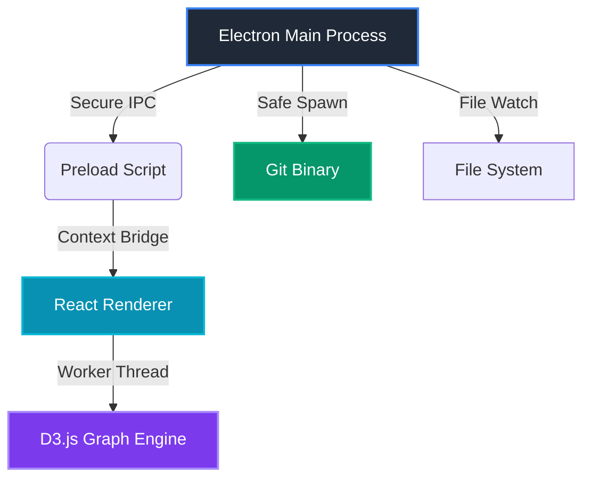

<div align="center">

# GitCanopy: Git Visulization Client designed for Professional Engineers

Transform complex commit histories into stable, readable graphs with a hyper-minimalist, lightning-fast workflow.

[](https://github.com/TainYanTun/GitCanopy/releases)
[](https://github.com/TainYanTun/GitCanopy/actions)
[](LICENSE)
[](https://github.com/TainYanTun/GitCanopy)

**The Architectural Spine of the Repository**


[Features](#-features) • [Download](#-download) • [Usage](#-usage) • [Roadmap](#-roadmap) • [Contributing](#-contributing)


</div>

---

## ✨ Features

- **Visualization Engine:** Lane-persistent commit graphs with semantic coloring and lineage tracing.
- **Professional Performance:** 60FPS virtualized rendering and background worker-powered layouts.
- **Seamless Workflow:** Atomic staging, high-fidelity diffs, and integrated remote synchronization.
- **Deep Insights:** Contributor metrics, file hotspot analysis, and a visual stash gallery.

---

## 📦 Download

GitCanopy is an open-source project hosted on GitHub. You can find the latest installers for macOS, Windows, and Linux on our **Releases** page:

👉 **[Download GitCanopy from GitHub](https://github.com/TainYanTun/GitCanopy/releases)**

> **Note for macOS users:** Since the app is currently unsigned, you will need to **Right-Click > Open** the first time you launch it to bypass the security verification.

### 🛠️ Development Setup
For developers looking to build from source or contribute, please refer to the [Setup Guide](setup.md).

---

## 🎮 Usage

- **Open Repository:** Click the button on the welcome screen or use `⌘ + O` / `Ctrl + O`.
- **Explore History:** Navigate the interactive **Graph** or search through the **Commit History**.
- **Manage Changes:** Stage, commit, and push your work from the **Changes View**.
- **Analyze Activity:** Use **Team Insights** and **File Hotspots** to track contributor impact.

> 💡 See [Full Documentation](documentation.md) for advanced features.

## ⌨️ Keyboard Shortcuts

### Essential Commands

| Action | macOS | Windows/Linux |
|--------|-------|---------------|
| Open Repository | `⌘ + O` | `Ctrl + O` |
| Refresh / Sync | `⌘ + R` | `Ctrl + R` |
| Commit Changes | `⌘ + Enter` | `Ctrl + Enter` |
| Search Commits | `⌘ + F` | `Ctrl + F` |
| Close Panel | `Esc` | `Esc` |
| Toggle Fullscreen | `⌃ + ⌘ + F` | `F11` |

---

## 🏗️ Technical Architecture

GitCanopy leverages a modern, type-safe stack designed for security, performance, and maintainability.



### Technology Stack

<table>
<tr>
<td><strong>Runtime</strong></td>
<td>Electron with isolated renderer and secure IPC</td>
</tr>
<tr>
<td><strong>Frontend</strong></td>
<td>React + TypeScript + Tailwind CSS (Zed-inspired theme)</td>
</tr>
<tr>
<td><strong>Visualization</strong></td>
<td>D3.js with Web Worker computation</td>
</tr>
<tr>
<td><strong>State Management</strong></td>
<td>Event-driven architecture with React Hooks</td>
</tr>
<tr>
<td><strong>Git Integration</strong></td>
<td>Native binary interaction with memory-safe buffers</td>
</tr>
</table>

---

## 🗺️ Roadmap

- [ ] **Visual Interactive Rebase:** Drag-and-drop history management and rewriting.
- [ ] **Conflict Resolution UI:** Advanced tools for solving complex merges.
- [ ] **Ecosystem Integration:** First-class support for GitHub, GitLab, and Bitbucket.
- [ ] **Extensibility:** Custom themes and commit classification plugin system.

---

## 🤝 Contributing

We welcome contributions from the community! Whether it's bug reports, feature requests, or code contributions, every bit helps make GitCanopy better. Refer to our [Development Guide](setup.md) to get started.

---

## 💖 Support the Project

GitCanopy is a solo developer project built with passion. If you find it useful, please consider supporting its growth:

- ⭐ **Star this repository** to help others discover the project.
- 🚀 **Share GitCanopy** with your team or on social media.
- 🤝 **[Sponsor the Developer](https://github.com/sponsors/TainYanTun)** on GitHub.

---

## 📄 License

Distributed under the **MIT License**. See [`LICENSE`](LICENSE) for more information.

```
MIT License - feel free to use GitCanopy in your projects,
modify it, and distribute it as you see fit.
```

---

<div align="center">

{ [Report Bug](https://github.com/TainYanTun/GitCanopy/issues/new?template=bug_report.md) • [Request Feature](https://github.com/TainYanTun/GitCanopy/issues/new?template=feature_request.md) • [Documentation](documentation.md) }

</div>
