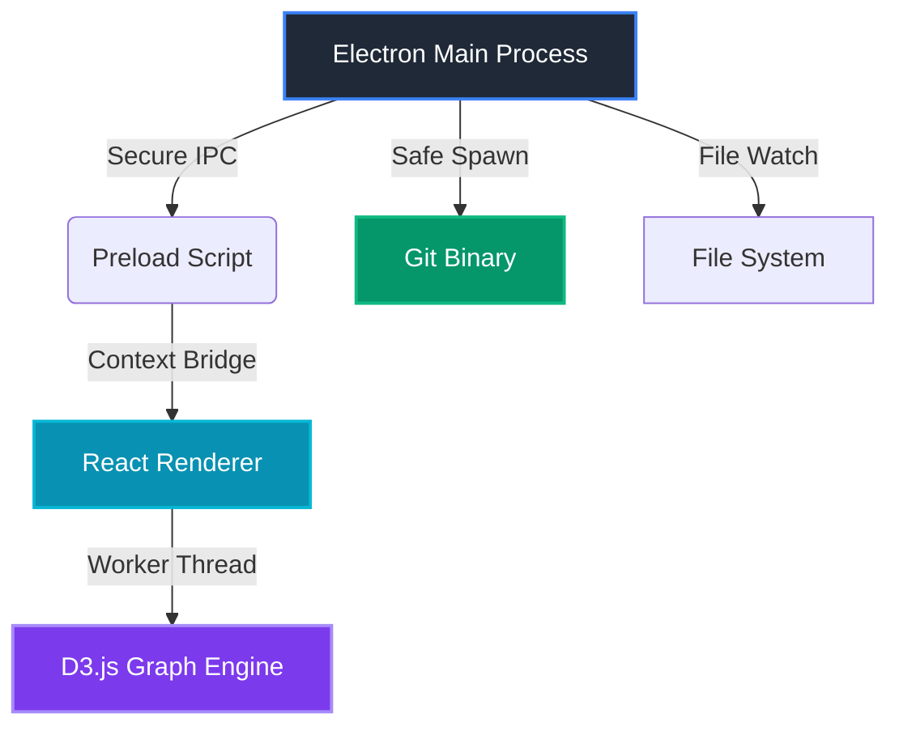

<div align="center">

# GitCanopy


**The Architectural Spine of Your Repository**

[](https://github.com/TainYanTun/GitCanopy/releases)
[](https://github.com/TainYanTun/GitCanopy/actions)
[](LICENSE)
[](https://github.com/TainYanTun/GitCanopy)

[Features](#-features) • [Installation](#-installation) • [Usage](#-usage) • [Roadmap](#-roadmap) • [Contributing](#-contributing)

</div>

---

## 📋 Overview

GitCanopy is a **high-performance, railway-style Git client** designed for professional engineers who demand architectural clarity over decorative clutter. Transform complex commit histories into stable, readable graphs with a hyper-minimalist, lightning-fast workflow.

### 🎯 Philosophy: Developer First

Traditional Git clients struggle with visualization clarity and repository scale. GitCanopy prioritizes **data density**, **rendering speed**, and **semantic clarity** to deliver an unmatched developer experience.

---

## ✨ Features

<table>
<tr>
<td width="50%">

### 🚆 Visualization Engine

**Main Spine Architecture**  
Vertical lanes lock your primary branch to the left, creating a stable reference point for navigation

**Semantic Coloring**  
Instantly recognize commit intent—Features, Fixes, Docs—through color-coded geometry

**Focus Mode**  
Hover over nodes to trace recursive lineage and isolate feature stories

</td>
<td width="50%">

### ⚡ Professional Performance

**Virtualized Rendering**  
Scroll through 10,000+ commits at 60FPS using industry-leading windowing

**Web Worker Layout**  
Off-thread graph calculations ensure zero UI lag

**Memory Safety**  
Safe spawn interaction with 10MB buffers prevents crashes on massive diffs

</td>
</tr>
<tr>
<td width="50%">

### ✍️ Seamless Workflow

**Uncommitted Changes**  
Dedicated view with high-fidelity unified diffs

**Stage & Commit**  
Keyboard-friendly interface for atomic commits

**Push & Sync**  
One-click remote synchronization

</td>
<td width="50%">

### 📊 Deep Insights

**Team Metrics**  
Analyze contributor impact and activity trends

**File Hotspots**  
Identify high-churn files and architectural bottlenecks

**Stash Gallery**  
Visual stash management at your fingertips

</td>
</tr>
</table>

---

## 🚀 Installation

### Prerequisites

Before you begin, ensure you have the following installed:

| Requirement | Version | Purpose |
|------------|---------|---------|
| **Node.js** | ≥ 18.0.0 | JavaScript runtime |
| **Git** | Latest | Version control (must be in PATH) |
| **Bun** | Latest | Fast package manager (recommended) |

### Quick Start

```bash
# 1. Clone the repository
git clone https://github.com/TainYanTun/GitCanopy.git
cd GitCanopy

# 2. Install dependencies (choose one)
bun install        # Recommended: Fastest
# or
npm install        # Alternative

# 3. Launch development mode
bun run dev
```

The application will start with hot-reload enabled for both Electron and React.

### 📦 Build for Production

```bash
# Create distributable for your current OS
bun run dist

# Outputs will be in the /dist directory
```

---

## 🎮 Usage

### Opening Your First Repository

<table>
<tr>
<td width="50%">

**Method 1: Welcome Screen**
1. Launch GitCanopy
2. Click **Open Repository**
3. Navigate to any folder with a `.git` directory

</td>
<td width="50%">

**Method 2: Keyboard Shortcut**
- macOS: `⌘ + O`
- Windows/Linux: `Ctrl + O`

</td>
</tr>
</table>

### 🧭 Interface Navigation

| View | Description |
|------|-------------|
| **Graph View** | Primary visual DAG for history navigation—the heart of GitCanopy |
| **Commit History** | Searchable, chronological list of all commits with filters |
| **Changes View** | Review, stage, and commit local modifications |
| **Team Insights** | Analytics dashboard for contributor activity |
| **Stash Manager** | Visual gallery of saved work-in-progress states |

> 💡 **Pro Tip:** For a comprehensive feature breakdown and advanced workflows, check out our [Full Documentation](documentation.md)

---

## ⌨️ Keyboard Shortcuts

### Essential Commands

| Action | macOS | Windows/Linux |
|--------|-------|---------------|
| Open Repository | `⌘ + O` | `Ctrl + O` |
| Refresh / Sync | `⌘ + R` | `Ctrl + R` |
| Commit Changes | `⌘ + Enter` | `Ctrl + Enter` |
| Search Commits | `⌘ + F` | `Ctrl + F` |
| Close Panel | `Esc` | `Esc` |
| Toggle Fullscreen | `⌃ + ⌘ + F` | `F11` |

---

## 🏗️ Technical Architecture

GitCanopy leverages a modern, type-safe stack designed for security, performance, and maintainability.



### Technology Stack

<table>
<tr>
<td><strong>Runtime</strong></td>
<td>Electron with isolated renderer and secure IPC</td>
</tr>
<tr>
<td><strong>Frontend</strong></td>
<td>React + TypeScript + Tailwind CSS (Zed-inspired theme)</td>
</tr>
<tr>
<td><strong>Visualization</strong></td>
<td>D3.js with Web Worker computation</td>
</tr>
<tr>
<td><strong>State Management</strong></td>
<td>Event-driven architecture with React Hooks</td>
</tr>
<tr>
<td><strong>Git Integration</strong></td>
<td>Native binary interaction with memory-safe buffers</td>
</tr>
</table>

---

## 🗺️ Roadmap

### 🏁 Phase 1: Core Performance ✅ *Current*

- [x] High-speed Git binary interaction with safety buffers
- [x] Virtualized commit history (60FPS scrolling)
- [x] Secure IPC bridge for Main/Renderer communication
- [x] Unified diff viewer with syntax highlighting

### 🚆 Phase 2: Advanced Visualization 🔄 *In Progress*

- [ ] Interactive D3.js commit graph with zoom/pan
- [ ] Recursive lineage tracing (Focus Mode)
- [ ] Multi-branch lane assignment optimization
- [ ] Real-time collaboration indicators

### 🛠️ Phase 3: Power User Tools 📅 *Planned*

- [ ] Visual Interactive Rebase
- [ ] Advanced Conflict Resolution UI
- [ ] Extension system for custom commit classifications
- [ ] AI-powered commit message suggestions
- [ ] Integrated code review workflow

### 🌐 Phase 4: Ecosystem Integration

- [ ] GitHub/GitLab/Bitbucket deep integration
- [ ] VS Code extension compatibility
- [ ] CLI companion tool
- [ ] Cloud sync for preferences

---

## 🤝 Contributing

We welcome contributions from the community! Whether it's bug reports, feature requests, or code contributions, every bit helps make GitCanopy better.

### How to Contribute

1. **Fork** the repository
2. **Create** your feature branch  
   ```bash
   git checkout -b feature/AmazingFeature
   ```
3. **Commit** your changes  
   ```bash
   git commit -m 'Add some AmazingFeature'
   ```
4. **Push** to the branch  
   ```bash
   git push origin feature/AmazingFeature
   ```
5. **Open** a Pull Request

### Development Guidelines

- Follow the existing code style (TypeScript + ESLint)
- Write tests for new features
- Update documentation as needed
- Keep commits atomic and well-described

### Priority Areas

Check our [Roadmap](#-roadmap) for current development priorities. Issues labeled `good-first-issue` are great entry points for new contributors.

---

## 📄 License

Distributed under the **MIT License**. See [`LICENSE`](LICENSE) for more information.

```
MIT License - feel free to use GitCanopy in your projects,
modify it, and distribute it as you see fit.
```

---

<div align="center">

**GitCanopy**:  [Report Bug](https://github.com/TainYanTun/GitCanopy/issues) • [Request Feature](https://github.com/TainYanTun/GitCanopy/issues) • [Documentation](documentation.md)

</div>
